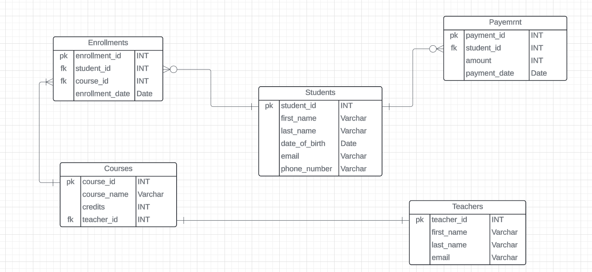

# Assignment-2(**Student information system**)
### Database Table
    The SIS database consists of following tables:
* Student
* Courses
* Enrollments
* Teacher
* Payments

> **Task-1: Database design**

1. Create the database named "SISDB"
~~~sql
CREATE DATABASE [SISDB];
USE [SISDB] 
~~~
2. Define the schema for the Students, Courses, Enrollments, Teacher, and Payments tables based
on the provided schema. Write SQL scripts to create the mentioned tables with appropriate data
types, constraints, and relationships.

    a. Students

    b. Courses

    c. Enrollments

    d. Teacher

    e. Payments
~~~sql
-- Students table
CREATE TABLE Students (
  [Student_id] INT  Not Null Primary Key ,
  [first_name] Varchar(100) ,
  [last_name] Varchar(100) , 
  [date_of_birth] Date ,
  [email] Varchar (150) ,
  [phone_number] varchar(50)
  );

-- Teacher table
CREATE TABLE Teacher(
 [teacher_id] INT not null Primary Key ,
 [first_name] varchar(50) ,
 [last_name] varchar(50) ,
 [email] varchar(100)
 );

-- Courses table
CREATE TABLE Courses (
 [course_id] INT not null Primary Key ,
 [course_name] varchar(20) ,
 [credits] INT ,
 [teacher_id] INT Foreign Key References Teacher(Teacher_id)
 );

-- Enrollments table
CREATE TABLE[Enrollments] (
[enrollment_id] INT NOT NULL PRIMARY KEY,
 [student_id] INT,
 [course_id] INT,
 [enrollment_date] DATE,
 FOREIGN KEY (student_id) REFERENCES Students(student_id),
FOREIGN KEY (course_id) REFERENCES Courses(course_id)
);

-- Payments table
CREATE Table payments(
 [payment_id] INT not null Primary Key ,
 [student_id] Int Foreign Key References Students(student_id) ,
 [amount] Deciamal(10,2) ,
 [payment_date] Date
); 
~~~
3. Create an ERD (Entity Relationship Diagram) for the database.

4. Create appropriate Primary Key and Foreign Key constraints for referential integrity.
    > Primary keys and foreign keys are defined above in table creation itself, ensuring referential integrity.

5. Insert at least 10 sample records into each of the following tables.
i. Students
ii. Courses
iii. Enrollments
iv. Teacher
v. Payments

~~~sql
--Inseting into students table
INSERT INTO Students (student_id, first_name, last_name, date_of_birth, email, phone_number)
VALUES
(1, 'Nura', 'Das', '2000-01-15', 'nura.das@example.com', '193-756-4453'),
(2, 'Jane', 'Smith', '1998-05-20', 'jane.smith@example.com', '234-567-8901'),
(3, 'Sam', 'Williams', '2001-03-12', 'sam.williams@example.com', '345-678-9012'),
(4, 'Emily', 'Johnson', '1999-11-25', 'emily.johnson@example.com', '456-789-0123'),
(5, 'Michael', 'Brown', '2000-07-30', 'michael.brown@example.com', '567-890-1234'),
(6, 'Olivia', 'Davis', '1997-09-10', 'olivia.davis@example.com', '678-901-2345'),
(7, 'Liam', 'Miller', '1998-12-01', 'liam.miller@example.com', '789-012-3456'),
(8, 'Sophia', 'Wilson', '2001-06-18', 'sophia.wilson@example.com', '890-123-4567'),
(9, 'Jacob', 'Taylor', '1999-02-22', 'jacob.taylor@example.com', '901-234-5678'),
(10, 'Mia', 'Anderson', '2000-04-05', 'mia.anderson@example.com', '012-345-6789');
~~~

~~~sql
--Inserting into teachers table
INSERT INTO Teacher (teacher_id, first_name, last_name, email)
VALUES
(1, 'Sarah', 'Connor', 'sarah.connor@example.com'),
(2, 'James', 'Clark', 'james.clark@example.com'),
(3, 'Laura', 'Lewis', 'laura.lewis@example.com'),
(4, 'Chris', 'Walker', 'chris.walker@example.com'),
(5, 'Emma', 'White', 'emma.white@example.com'),
(6, 'Daniel', 'Hall', 'daniel.hall@example.com'),
(7, 'Grace', 'King', 'grace.king@example.com'),
(8, 'Matthew', 'Green', 'matthew.green@example.com'),
(9, 'Lucas', 'Baker', 'lucas.baker@example.com'),
(10, 'Chloe', 'Campbell', 'chloe.campbell@example.com'),
(11,'Rakul','Kushar','rakul.kushar@example.com');
~~~

~~~sql
--Inserting into Courses table
INSERT INTO Courses (course_id, course_name, credits, teacher_id)
VALUES
(1, 'Mathematics 101', 3, 1),
(2, 'Physics 101', 4, 2),
(3, 'Chemistry 101', 4, 3),
(4, 'Biology 101', 3, 4),
(5, 'English 101', 3, 5),
(6, 'History 101', 3, 6),
(7, 'Geography 101', 3, 7),
(8, 'Art 101', 2, 8),
(9, 'Music 101', 2, 9),
(10, 'Computer Science 101', 3, 11);
~~~

~~~sql
--Inserting into Enrollment table
INSERT INTO Enrollments (enrollment_id, student_id, course_id, enrollment_date)
VALUES
(1, 1, 1, '2023-01-10'),
(2, 2, 9, '2023-01-11'),
(3, 3, 3, '2023-01-12'),
(4, 4, 4, '2023-01-13'),
(5, 5, 9, '2023-01-14'),
(6, 2, 6, '2023-01-15'),
(7, 7, 7, '2023-01-16'),
(8, 8, 8, '2023-01-17'),
(9, 9, 9, '2023-01-18'),
(10, 10, 3, '2023-01-19'),
(12,11 , 9, '2023-01-20'),
(13,4,7,'2023-04-05'),
(14,7,4,'2023-04-13');
~~~

~~~sql
--Inserting into Payments
INSERT INTO Payments (payment_id, student_id, amount, payment_date)
VALUES
(1, 1, 300.00, '2023-01-25'),
(2, 2, 400.00, '2023-01-26'),
(3, 8, 400.00, '2023-01-27'),
(4, 4, 300.00, '2023-01-28'),
(5, 5, 300.00, '2023-01-29'),
(6, 2, 300.00, '2023-01-30'),
(7, 7, 300.00, '2023-01-31'),
(8, 8, 200.00, '2023-02-01'),
(9, 9, 200.00, '2023-02-02'),
(10, 10, 100.00, '2023-02-03'),
(11, 8, 500.00, '2023-03-08');
~~~
> **Task-2: Select, Where, Between, AND, LIKE**

1. Write an SQL query to insert a new student into the "Students" table with the following details:

    a. First Name: John

    b. Last Name: Doe

    c. Date of Birth: 1995-08-15

    d. Email: john.doe@example.com

    e. Phone Number: 1234567890

~~~sql
INSERT INTO Students (student_id, first_name, last_name, date_of_birth, email, phone_number)
VALUES (11,'John', 'Doe', '1995-08-15', 'john.doe@example.com', '1234567890');
~~~
2. Write an SQL query to enroll a student in a course. Choose an existing student and course and
insert a record into the "Enrollments" table with the enrollment date.

~~~sql
INSERT INTO enrollments values(11,8,4,'2023-02-11');
~~~
3. Update the email address of a specific teacher in the "Teacher" table. Choose any teacher and
modify their email address.
~~~sql
UPDATE Teacher
SET email='ewtham.green@example.com'
where teacher_id=8;
~~~
4.  Write an SQL query to delete a specific enrollment record from the "Enrollments" table. Select
an enrollment record based on the student and course.
~~~sql
DELETE FROM enrollments
WHERE student_id=4 AND course_id=4;
~~~
5. Update the "Courses" table to assign a specific teacher to a course. Choose any course and
teacher from the respective tables.
~~~sql
UPDATE courses 
SET teacher_id = 11 WHERE course_name='English 101';
~~~

6. Delete a specific student from the "Students" table and remove all their enrollment records
from the "Enrollments" table. Be sure to maintain referential integrity.
~~~sql
DELETE FROM Enrollments
WHERE Student_id= 11;
DELETE FROM Students
WHERE student_id = 11;
~~~
7. Update the payment amount for a specific payment record in the "Payments" table. Choose any
payment record and modify the payment amount.
~~~sql
UPDATE Payments
SET amount= 600 WHERE Student_id=8;
~~~
> **Task 3. Aggregate functions, Having, Order By, GroupBy and Joins:**
1. Write an SQL query to calculate the total payments made by a specific student. You will need to
join the "Payments" table with the "Students" table based on the student's ID.
~~~sql
SELECT s.first_name,sum(amount) as total FROM payments p
Inner join students s
ON p.student_id=s.student_id
WHERE p.student_id=8
GROUP BY s.first_name;
~~~
2. Write an SQL query to retrieve a list of courses along with the count of students enrolled in each
course. Use a JOIN operation between the "Courses" table and the "Enrollments" table.
~~~sql
SELECT c.course_name, count(e.student_id) as [students_enrolled] FROM courses c
left join enrollments e 
on c.course_id=e.course_id
GROUP BY course_name;
~~~
3. Write an SQL query to find the names of students who have not enrolled in any course. Use a
LEFT JOIN between the "Students" table and the "Enrollments" table to identify students
without enrollments.
~~~sql
SELECT s.first_name, count(e.course_id) as [not_enrolled]  FROM students s
left join enrollments e
on s.student_id = e.student_id
GROUP BY  s.first_name
HAVING count(e.course_id)=0;
~~~
4. Write an SQL query to retrieve the first name, last name of students, and the names of the
courses they are enrolled in. Use JOIN operations between the "Students" table and the
"Enrollments" and "Courses" tables.
~~~sql
SELECT s.student_id, s.first_name ,s.last_name, c.course_name
FROM Students s
JOIN Enrollments e ON s.student_id = e.student_id
JOIN Courses c ON e.course_id = c.course_id
WHERE e.course_id =(c.course_id)
order by s.student_id; 
~~~
5. Create a query to list the names of teachers and the courses they are assigned to. Join the
"Teacher" table with the "Courses" table.
~~~sql
SELECT t.first_name,t.last_name,c.course_name
FROM Teacher
JOIN Courses
ON t.teacher_id = c.teacher_id;
~~~
6. Retrieve a list of students and their enrollment dates for a specific course. You'll need to join the
"Students" table with the "Enrollments" and "Courses" tables.
~~~sql
SELECT s.first_name , e.enrollment_date , c.course_name FROM students s
JOIN enrollments e on s.student_id=e.student_id
LEFT JOIN courses c on e.course_id=c.course_id
where c.course_id=4;
~~~
7. Find the names of students who have not made any payments. Use a LEFT JOIN between the
"Students" table and the "Payments" table and filter for students with NULL payment records.
~~~sql
SELECT s.first_name,s.last_name FROM students s
LEFT JOIN payments p on p.student_id=s.student_id
WHERE p.student_id is NULL;
~~~
8. Write a query to identify courses that have no enrollments. You'll need to use a LEFT JOIN
between the "Courses" table and the "Enrollments" table and filter for courses with NULL
enrollment records.
~~~sql
SELECT c.course_id ,c.course_name FROM courses c
LEFT JOIN enrollments e on c.course_id=e.course_id 
where e.course_id is null;
~~~
9. Identify students who are enrolled in more than one course. Use a self-join on the "Enrollments"
table to find students with multiple enrollment records.
~~~sql
SELECT s.first_name,COUNT(e.enrollment_id) AS [courses_enrolled]
FROM Students s
JOIN Enrollments e ON s.student_id = e.student_id
GROUP BY s.first_name
HAVING COUNT(e.course_id) > 1;
~~~
10. Find teachers who are not assigned to any courses. Use a LEFT JOIN between the "Teacher"
table and the "Courses" table and filter for teachers with NULL course assignments.
~~~sql
SELECT t.teacher_id,t.first_name,t.last_name FROM Teacher t
LEFT JOIN courses c ON t.teacher_id=c.teacher_id
WHERE c.teacher_id IS NULL
~~~

> **Task 4.Subquery ant its type :**

1. Write an SQL query to calculate the average number of students enrolled in each course. Use aggregate functions and subqueries to achieve this.
~~~sql
SELECT AVG(enrollment_count) AS avg_no_of_students
FROM (
    SELECT COUNT(*) AS enrollment_count
    FROM Enrollments
    GROUP BY student_id
) AS enrollment_counts;
~~~
2. Identify the student(s) who made the highest payment. Use a subquery to find the maximum payment amount and then retrieve the student(s) associated with that amount.
~~~sql
SELECT first_name AS [name_of_std],max(p.amount) AS [max_amount] FROM students s 
JOIN payments p ON s.student_id = p student_id
GROUP BY s.first_name
HAVING max(p.amount)=(SELECT  max(amount) FROM payments);
~~~
3. Retrieve a list of courses with the highest number of enrollments. Use subqueries to find the course(s) with the maximum enrollment count.
~~~sql
SELECT c.course_name, e.course_count
FROM Courses c
JOIN (
    SELECT course_id, COUNT(*) AS course_count
    FROM Enrollments
    GROUP BY course_id
) AS e ON c.course_id = e.course_id
WHERE e.course_count = (
    SELECT MAX(course_count)
    FROM (
        SELECT course_id, COUNT(*) AS course_count
        FROM Enrollments
        GROUP BY course_id
    ) AS enrollment_counts
);

~~~
4. Calculate the total payments made to courses taught by each teacher. Use subqueries to sum payments for each teacher's courses.
~~~sql
SELECT t.teacher_id,t.first_name,t.last_name,c.course_name,COALESCE(SUM(p.amount), 0) 
FROM Teacher t
LEFT JOIN Courses c ON t.teacher_id = c.teacher_id
LEFT JOIN Payments p ON c.course_id = p.student_id
GROUP BY t.teacher_id, t.first_name, t.last_name, c.course_name
ORDER BY t.teacher_id;
~~~
5. Identify students who are enrolled in all available courses. Use subqueries to compare a student's enrollments with the total number of courses.
~~~sql
SELECT student_id, first_name, last_name
FROM Students
WHERE (
    SELECT COUNT(DISTINCT course_id)
    FROM Enrollments
    ) = (
    SELECT COUNT(DISTINCT course_id)
    FROM Courses
    );
~~~
6. Retrieve the names of teachers who have not been assigned to any courses. Use subqueries to find teachers with no course assignments.
~~~sql
SELECT first_name FROM teacher 
WHERE teacher_id NOT IN(
	SELECT DISTINCT (teacher_id) FROM courses
);
~~~
7.  Calculate the average age of all students. Use subqueries to calculate the age of each student based on their date of birth
~~~sql
SELECT AVG(DATEDIFF(YEAR,date_of_birth, GETDATE())) AS average_age
FROM Students ;
~~~
8. Identify courses with no enrollments. Use subqueries to find courses without enrollment records.
~~~sql
SELECT *
FROM Courses
WHERE course_id NOT IN (
    SELECT DISTINCT course_id
    FROM Enrollments
);
~~~
9. Calculate the total payments made by each student for each course they are enrolled in. Use subqueries and aggregate functions to sum payments.
~~~sql
SELECT s.first_name, s.last_name, c.course_name, SUM(p.amount) AS total_payments
FROM Students s
JOIN Enrollments e ON s.student_id = e.student_id
JOIN Courses c ON e.course_id = c.course_id
JOIN Payments p ON s.student_id = p.student_id
GROUP BY s.student_id, c.course_id, c.course_name, s.first_name, s.last_name;
~~~
10.  Identify students who have made more than one payment. Use subqueries and aggregate functions to count payments per student and filter for those with counts greater than one.
~~~sql
SELECT s.first_name, s.last_name
FROM Students s
WHERE (
    SELECT COUNT(p.payment_id)
    FROM Payments p
    WHERE p.student_id = s.student_id
) > 1;
~~~
11.  Write an SQL query to calculate the total payments made by each student. Join the "Students" table with the "Payments" table and use GROUP BY to calculate the sum of payments for each student.
~~~sql
SELECT s.student_id,
       s.first_name,
       s.last_name,
       COALESCE(SUM(Payments.amount), 0) AS total_payments
FROM Students s
LEFT JOIN Payments p ON s.student_id = p.student_id
GROUP BY s.student_id, s.first_name, s.last_name;
~~~
12.  Retrieve a list of course names along with the count of students enrolled in each course. Use JOIN operations between the "Courses" table and the "Enrollments" table and GROUP BY to count enrollments.
~~~sql
SELECT c.course_name, COUNT(e.student_id) AS enrolled_std_count
FROM Courses c
LEFT JOIN Enrollments ON c.course_id = e.course_id
GROUP BY c.course_name;
~~~
13.  Calculate the average payment amount made by students. Use JOIN operations between the "Students" table and the "Payments" table and GROUP BY to calculate the average.
~~~sql
SELECT AVG(p.amount) AS average_payment
FROM Payments p
JOIN Students s ON s.student_id = p.student_id
GROUP BY s.student_id;
~~~
