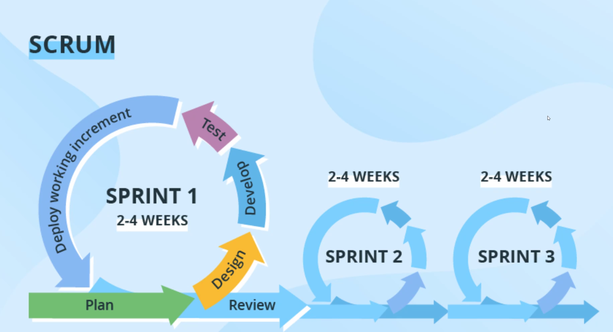

# Software Life Cycle

## Phases of Software Life Cycle
1. Planning
2. Analysis
3. Design 
4. Implementation 
5. Testing 
6. Maintenan
# Agile

* Allow changes at any stage
* Works based on iterative approach
* Plan , develop then evaluation

## Agile vs Waterfall Model

> waterfall model-

* Rigit
* Work on preplanned manner
* Complicated to change in bettwen
* Time taking and costly

> Agile model-

* It overcome the all disadvantages of waterfall model
* flexible to changes
* follow unit process 
* Prioritised customer 

# Scrum

  * It is agile framework
  * Deliver value incrementally in a collaborative way
  * fundamental unnit of scrum is team of people (**scrum team**)
  

> ***Scrum include***
* Developers
* Product owner
* SCRUM Master

> ***Scrum phase***

- Sprint
- Sprint Planning
- Daily Scrum / Daily Standup
- Sprint review (Not happening now a days)
- Sprint retrospective

> ***Scrum tool used for analysment or tracking***
- Kanban boards
- Burn-down charts

