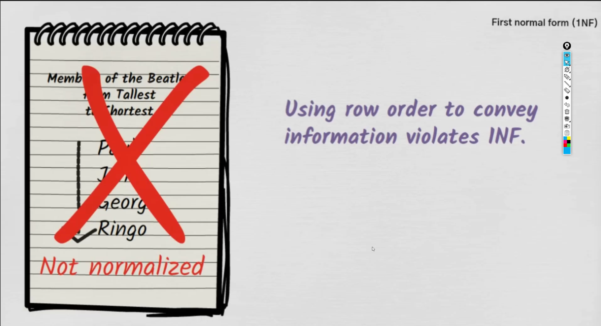
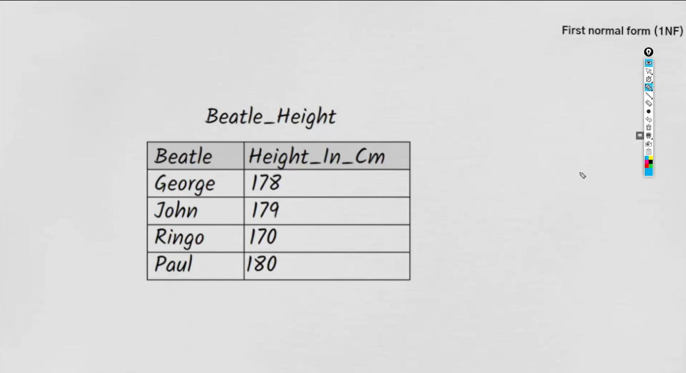
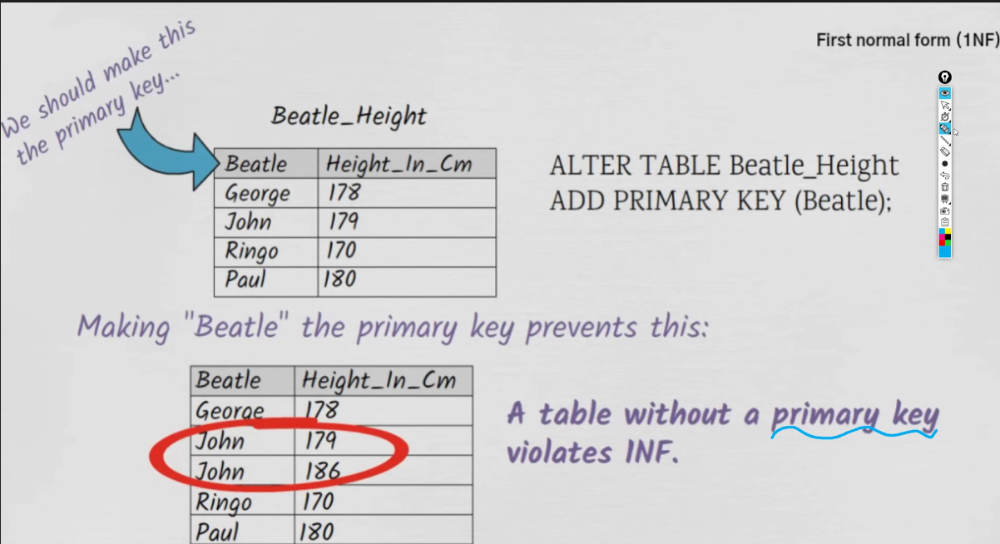
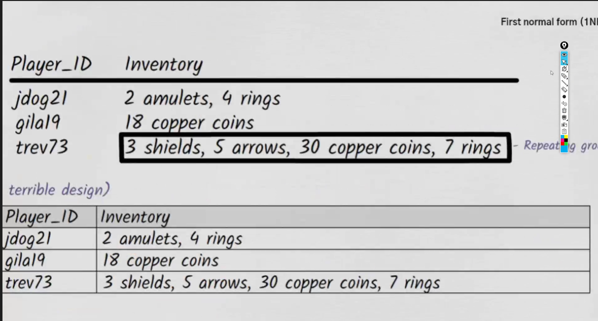
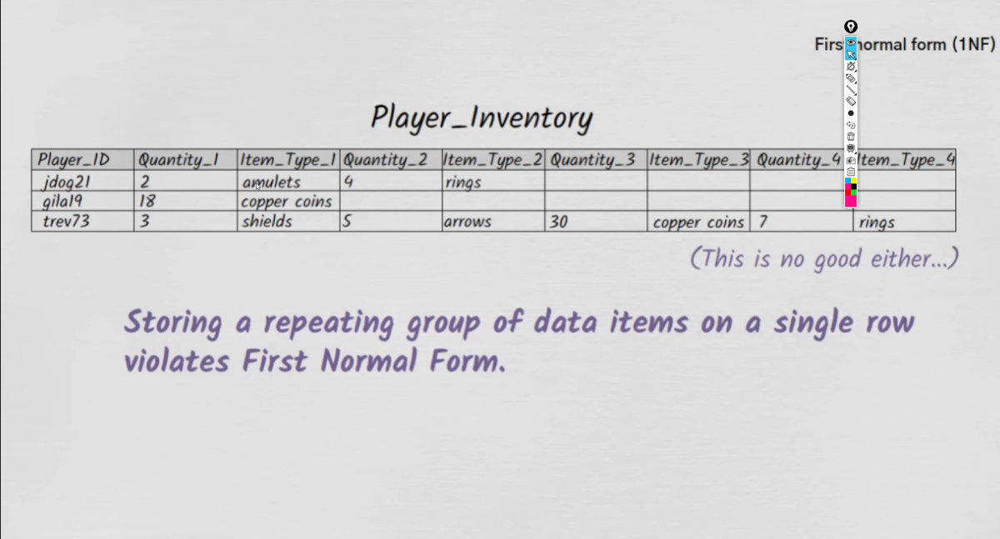
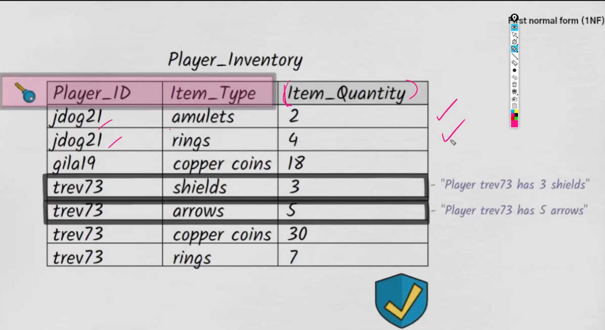
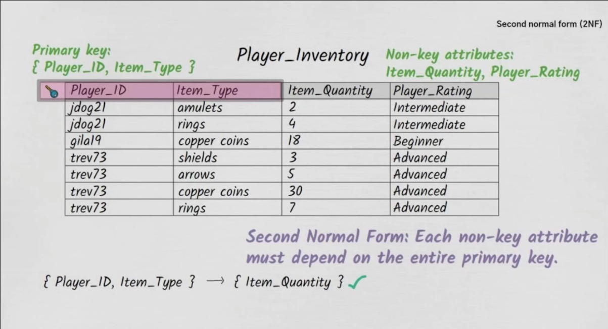
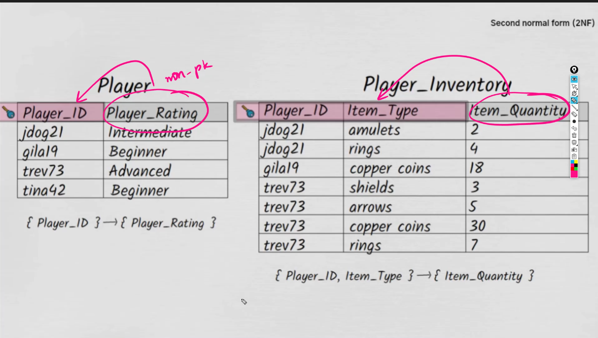
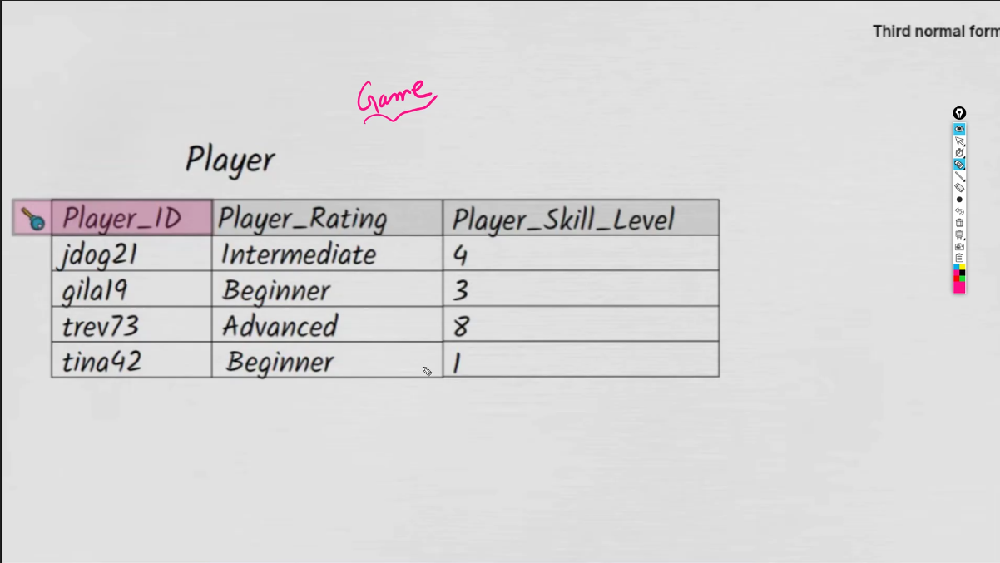

# SQL and Cloud 
## Introduction to Database
It is special software for data.
> **Database lives-**
* It live in cloud.
* Can store in local machines but it will not handel the network traffic
* Cloud is renting out server for pay as per use
* Some cloud providers are:
  * AWS
  * Azure by microsoft
  * IBM
  * Alibaba cloud

### Benifits of cloud -
* Rent service which make flexible
* No need to buy software licenses
* scalability
* pay per use
* Maintainance and everything done by provider

### Scaling:
> Types
- Vertical(Add or increase Ram when required)
- Horizontal(Add system after Ram limit reaches)

Autoscaling is feature provided to handel more traffic automatically by adding the service(increase or decrese the rent of PC's)

### cloud OS -
Cloud use Linux because of its benifits that are:
  * free 
  * secure
  * opensource
  * Automation
  * Alphine take 256Mb only to good to use save storage and can be used for the other things

### Feature why we are going with database -
* frequently asked things it will have it in Ram
* quering becomes easier
* CRUD easy
* UNDO easily
* performance

### Databases types:
* Relational Databases
* Non-Relational Databases

## Relational Databases

1.PL SQL

2.MySQL

3.Postgres SQL

4.Amazon RDS

5.MS SQL

## Non-Relational Databases

1.Mongo DB

1.Couch DB

1.Redis(fast because it use RAM good at cashing)

2.Cassandra

2.Dynamo DB

2.Neo4j

# SQL(Sequentical query language)
***SQL Lesson 1: SELECT queries 101***

1.Find the title of each film
~~~sql
  SELECT title FROM mytable;
~~~
2.Find the director of each film
~~~sql
SELECT Director FROM mytable;
~~~
3.Find the title and director of each film
~~~sql
SELECT title , director FROM mytable;
~~~
4.Find the title and year of each film
~~~sql
SELECT title , year FROM mytable;
~~~
5.Find all the information about each film
~~~sql
SELECT * FROM mytable;
~~~

***SQL Lesson 2: Queries with constraints (Pt. 1)**

1.Find the movie with a row id of 6 
~~~sql
  SELECT title,id FROM mytable
  where id=6;
~~~
2.Find the movies released in the years between 2000 and 2010
~~~sql
SELECT title,year FROM mytable
where year between 2000 and 2010;
~~~
3.Find the movies not released in the years between 2000 and 2010
~~~sql
SELECT title , director FROM mytable
where year not between 2000 and 2010;;
~~~
4.Find the first 5 Pixar movies and their release year
~~~sql
SELECT title,year FROM movies
where id<6;
~~~

***Queries with constraints (Pt. 2)***

1.Find all the Toy Story movies
~~~sql
SELECT title,director FROM mytable
Where title LIKE "Toy Story%";
~~~
2.Find all the movies directed by John Lasseter
~~~sql
SELECT title , director FROM mytable
where director="John Lasseter";
~~~
3.Find all the movies (and director) not directed by John Lasseter
~~~sql
SELECT title,director FROM mytable
where director!="John Lasseter";
~~~
4.Find all the WALL-* movies
~~~sql
SELECT * FROM mytable
where title LIKE "WALL%";
~~~

***SQL Lesson 4: Filtering and sorting Query results***

1.List all directors of Pixar movies (alphabetically), without duplicates
~~~sql
SELECT DISTINCT director FROM mytable
order by directore ASC;
~~~
2.List the last four Pixar movies released (ordered from most recent to least)
~~~sql
SELECT title,year FROM mytable
order by year DESC limit=4;
~~~
3.List the first five Pixar movies sorted alphabetically
~~~sql
SELECT title,year FROM mytable
order by title ASC limit 5;
~~~
4.List the next five Pixar movies sorted alphabetically
~~~sql
SELECT title FROM mytable
order by title ASC 
limit 5 offset 5;
~~~

***SQL Review: Simple SELECT Queries***

1.List all the Canadian cities and their populations
~~~sql
SELECT country , population FROM mytable
where country=Canada;
~~~
2.Order all the cities in the United States by their latitude from north to south
~~~sql
SELECT country,city,latitute FROM mytable
where country="United states"
order by latitute DESC;
~~~
2.List all the cities west of Chicago, ordered from west to east
~~~sql
SELECT city, longitude FROM north_american_cities
WHERE longitude < -87.629798
ORDER BY longitude ASC;
~~~
3.List the two largest cities in Mexico (by population)
~~~sql
SELECT city,country,population FROM mytable
where country="Mexico" order by population DESC
limit 2;
~~~
4.List the third and fourth largest cities (by population) in the United States and their population
~~~sql
SELECT city,country,population FROM mytable
where country="United States" order by population DESC limit 2 offset 2;
~~~

***SQL Lesson 6: Multi-table queries with JOINs***

1.Find the domestic and international sales for each movie 
~~~sql
SELECT title,internation_sales,domestic_sales FROM mytable
INNER JOIN Boxoffice
ON mytable.id=Boxoffice.movie_id;
~~~
2.Show the sales numbers for each movie that did better internationally rather than domestically
~~~sql
SELECT title, domestic_sales, international_sales
FROM movies
  JOIN boxoffice
    ON movies.id = boxoffice.movie_id
WHERE international_sales > domestic_sales;
~~~
3.List all the movies by their ratings in descending order
~~~sql
ELECT title, domestic_sales, international_sales
FROM movies
  JOIN boxoffice
    ON movies.id = boxoffice.movie_id
order by rating DESC;
~~~

***SQL Lesson 7: OUTER JOINs***

1.Find the list of all buildings that have employees
~~~sql
SELECT DISTINCT building FROM employees;
~~~
2.Find the list of all buildings and their capacity
~~~sql
SELECT building_name,capacity FROM building;
~~~
3.List all buildings and the distinct employee roles in each building (including empty buildings)
~~~sql
SELECT DISTINCT building_name, role 
FROM buildings 
  LEFT JOIN employees
    ON building_name = building;
~~~

***SQL Lesson 8: A short note on NULLs***

1.Find the name and role of all employees who have not been assigned to a building 
~~~sql
SELECT name , role FROM employees
where building IS NULL;
~~~
2.Find the names of the buildings that hold no employees
~~~sql
SELECT DISTINCT building_name
FROM buildings 
  LEFT JOIN employees
    ON building_name = building
WHERE role IS NULL;
~~~

***SQL Lesson 9: Queries with expressions***

1.List all movies and their combined sales in millions of dollars
~~~sql
 SELECT title, (domestic_sales + international_sales) / 1000000 AS gross_sales_millions
FROM movies
  JOIN boxoffice
    ON movies.id = boxoffice.movie_id;
~~~
2.List all movies and their ratings in percent
~~~sql
SELECT title, rating * 10 AS rating_percent
FROM movies
  JOIN boxoffice
    ON movies.id = boxoffice.movie_id;
~~~
3.List all movies that were released on even number years
~~~sql
SELECT title, year
FROM movies
WHERE year % 2 = 0;
~~~

### Types of Anomalies in SQL

1. **Updation Anomaly**
    
    If data stored redundantly in the  table and the person misses any of it, then there will be multiple titles assocciated with a single employee. 
    
2. **Insertion Anomaly**
    
    For example, if a system is designed to require that a customer be on file before a sale can be made to that customer, but you cannot add a customer until they have bought something, then you have an insert anomaly. It is the classic "catch-22" situation.
    
3. Deletion Anomaly
    
    For example, if a single database record contains information about a particular product along with information about a salesperson for the company and the salesperson quits, then information about the product is deleted along with salesperson information. 
    

### Types of Keys

1. Canditate Key
2. Primary Key
3. Super Key
4. Foreign Key
5. Composite Key
6. Alternate Key
7. Unique Key

## Normalization

Normalization is process of ensuring safety to our data in the database. It aims to eliminate redundant data, minimize data modification errors and simplify  the querying process.

There are 5 levels of Normal Form:

### First Normal Form (1NF)

- Rule 1: Do not use row order to convey information

- Rule 2: Mixing Datatype is not allowed

- Rule 3: Every table should have a primary key

- Rule 4: Repeating Groups are not permitted

The data items amulets rings copper coins are getting  repeated in each row

## Second Normal Form 2NF:

- Rule 1: It must be in First Normal Form
- Rule 2: Each Non-key attribute must depend on entire primary key

This table is not  in 2NF as the player_rating column is dependent on the  item_quantity, rather than the composite primary key {player_id, item_type} which violates 2NF

The table is then splitted into separate tables. Now each non-key attributes on each table  is  dependent  on their corresponding primary key.

## Third Normal Form 3NF

- Rule 1: It should be in 2NF and 3NF
- Rule 2: Every  non-key attribute on the table should depend on the key, the whole key, nothing but the key.

In this example the a non-key attribute “player_skill_level” is entirely dependent on another non-key attribute “player_rating” which violates 3NF

