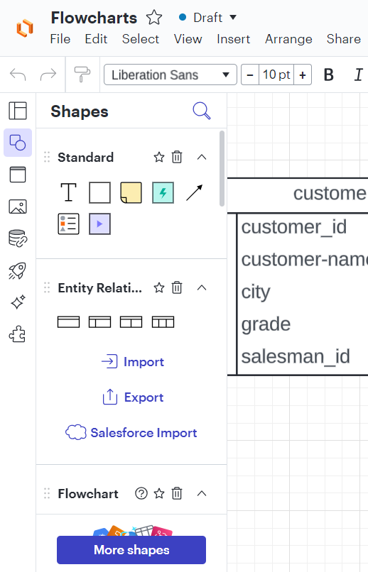
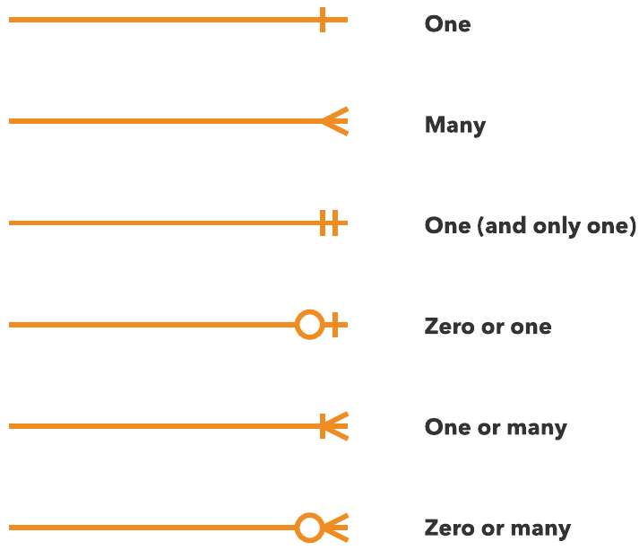
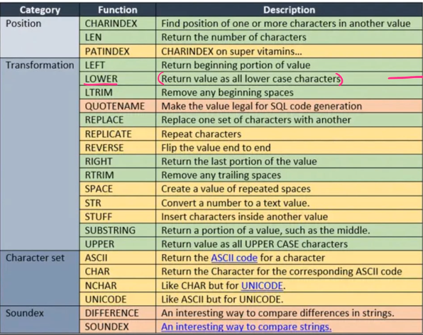

## Querying in SSMS

1. Writing a query to find all the orders attributed to Newyork salesman

```sql
SELECT a.*  
FROM orders as a INNER JOIN salesman AS b
ON a.salesman_id = b.salesman_id
WHERE b.city IN ('Paris')
```

```sql
SELECT *
FROM orders 
WHERE salesman_id IN (
	SELECT salesman_id
	FROM salesman
	WHERE city='Paris'
);
```

For understanding this query let’s analyse the sub-query first

```sql
SELECT salesman_id
	FROM salesman
	WHERE city='Paris';
```

The result of the above query gives the `salesman_id` of the salesman whose `city` is Paris


For the outer query,

```sql
SELECT *
FROM orders 
WHERE salesman_id IN (
	....
);
```

This result of the above query will give us all the order details from the records of “order” table where the `salesman_id` field is in the `(….)`

If we combine both the queries, we can have our desired output.

## ANY and ALL Operators in SQL

We all know that in where clause we cannot compare a table value with multiple value using `<, >, =, !=` … and so on.

If we do that we get a error saying,

```

Subquery returned more than 1 value. This is not permitted when the subquery follows =, !=, <, <= , >, >= or when the subquery is used as an expression.

```

This is because by default the `WHERE`  clause compares each value with only one target value.

To oveercome this we can make use of `ANY` , `ALL`  operators.

For the next task let’s first create a `customer` table.

```sql
CREATE TABLE customer (
    customer_id INT PRIMARY KEY,
    cust_name VARCHAR(255),
    city VARCHAR(255),
    grade INT NULL,
    salesman_id INT
);
```

Now that we have created `customer` table, let’s fill up the data.

```sql
INSERT INTO customer (customer_id, cust_name, city, grade, salesman_id) VALUES
(3002, 'Nick Rimando', 'New York', 100, 5001),
(3005, 'Graham Zusi', 'California', 200, 5002),
(3001, 'Brad Guzan', 'London', NULL, 5005),
(3004, 'Fabian Johns', 'Paris', 300, 5006),
(3007, 'Brad Davis', 'New York', 200, 5001),
(3009, 'Geoff Camero', 'Berlin', 100, 5003),
(3008, 'Julian Green', 'London', 300, 5002),
(3003, 'Jozy Altidor', 'Moscow', 200, 5007);
```

1. Write a query to find the name and id of all salesmen who had more than one customer

Method 1: Using `IN`  along with `WHERE`

```sql
SELECT salesman_id, name
FROM salesman
WHERE salesman_id IN(
	SELECT salesman_id
	FROM customer
	GROUP BY salesman_id
	HAVING COUNT(customer_id) > 1
)
```

Method 2: Using `ANY`  along with `WHERE`

```sql
SELECT salesman_id, name
FROM salesman
WHERE salesman_id = ANY(
	SELECT salesman_id
	FROM customer
	GROUP BY salesman_id
	HAVING COUNT(customer_id) > 1
)
```

**Task 9:  Write a query to display only those customers whose grade or greater than every customer in newyork**

Step 1: Selecting customers from New york

```sql
SELECT *
FROM customer
WHERE city = 'New York'
```

Step 2: To getting all thee customers whose grade are greater than those of the above query

- Method 1: Using `MAX()`
    
    ```sql
    SELECT *
    FROM customer
    WHERE grade > (
    SELECT MAX(grade)
    FROM customer
    WHERE city = 'New York'
    )
    ```
    

- Method 2: Using `ALL`
    
    ```sql
    SELECT *
    FROM customer
    WHERE grade > ALL(
    SELECT grade
    FROM customer
    WHERE city = 'New York'
    )
    ```
    

**Task 10: Write a query to find all orders with an amount smaller than any amount for a customer in London**

- Step 1: Selecting customers from London
    
    ```sql
    SELECT *
    FROM customer
    WHERE city = 'London'
    ```
    
- Step 2: Selecting orders with amount smaller than any particular order (HARD CODE)
    
    ```sql
    SELECT *
    FROM orders
    WHERE purch_amt < 120
    ```
    

- Step 3: Selecting orders with amount smaller than minimum order of any random customer
    
    ```sql
    SELECT *
    FROM orders
    WHERE purch_amt < (
    					SELECT MIN(purch_amt)
    					FROM orders
    					WHERE customer_id = 3001
    );
    ```
    
- Step 4: Selecting customer_id of the customer whose from London City.
    
    ```sql
    SELECT *
    FROM orders
    WHERE purch_amt < (
    					SELECT MIN(purch_amt)
    					FROM orders
    					WHERE customer_id IN (
    										    SELECT customer_id
    										    FROM customer
    											WHERE city = 'London'
    										)
    );
    ```
    

# Designing a Database with Lucid

**W**e know how to create a table through DDL commands. That’s for sure. But now comes the more crucial parts.

- What tables do I need to create?
- How they’re related to each other?

This is where Entity-Relationship Diagram comes in. ER diagrams provide a high-level overview of what are all the tables, and how they are related to each other. We can make ER diagram easily with a pen & paper. But it is always recommended to make ER diagrams digital to ensure it is more flexible.

There are several tools out there for designing ER diagram of a database. We’re going to use Lucid for creating ER diagram

To visit Lucid - [Click here](http://lucid.co) 

## Familiarise with Lucid

Step 1: Once you open Lucid, Click on “**More shapes”** in the toolbar



Step 2: Then select **“Entity relationship”** and click **“Use selected shapes”**


Step 3: There are three four different visual representation of an entity in Lucid

1. **Only Field**
    
    This might be useful if you’re preparing the ER Diagram to person who is not that much familiar with databases. This will help you provide a high level overview of what will the database be look like.
    
2. **Field along with it Keys (If any)**
3. **Field along with its Datatype** 
4. **Field along with its Keys and Datatypes together**


Step 4: Knowing about the arrows. The following legend might help you understand the arrows of ER Diagrams



[https://lucid.app/lucidchart/64013a38-8b5a-4599-8a81-289744cf4519/edit?beaconFlowId=702F752CE0F39FFA&invitationId=inv_350620b4-c2c7-427e-8aaf-d16916c789bd&page=0_0#?from_internal=true](https://lucid.app/lucidchart/64013a38-8b5a-4599-8a81-289744cf4519/edit?beaconFlowId=702F752CE0F39FFA&invitationId=inv_350620b4-c2c7-427e-8aaf-d16916c789bd&page=0_0#?from_internal=true)

With Foreign key referencee if you wish to delete a record use `ON DELETE CASCADE`  at the time of table creation to ensure whenever a data gets deleted all the data associated with it also get deleted

## Frequently Used In-Built Function in SQL

We have several in-built function in SQL which can perform various tasks that are typically performed in programming languages.

Let’s create a EmployeeData database to test these functions

```sql
CREATE TABLE EmployeeData (
    EmployeeID INT PRIMARY KEY,
    FirstName VARCHAR(50),
    LastName VARCHAR(50),
    Salary INT,
    StartDate DATE
);

INSERT INTO EmployeeData (EmployeeID, FirstName, LastName, Salary, StartDate) VALUES
(1, 'John', 'Doe', 70000, '2020-05-01'),
(2, 'Jane', 'Smith', 85000, '2018-08-15'),
(3, 'Emily', 'Jones', 94000, '2019-12-30'),
(4, 'Chris', 'Brown', 62000, '2021-03-22');
```

### **String Functions**

Some of the mostly use string functions are as follows

- `LEN()` Finds and returns the length of the string
- `CONCAT()` Concatenate the given strings in the function
- `LEFT()`  breaks the string into sub string from left
- `RIGHT()`  breaks the string into sub string from right
- `RTRIM()` trims extra whitespace character from start of the string
- `LTRIM()`  trims extra whitespace character from end of the string
- `SUBSTRING()`  as names suggests for creating Substrings



Task -1

Sort the employees based om the length of their first namw

```sql
SELECT FirstName
FROM EmployeeData
ORDER BY len(FirstName) DESC
```

Task -2 

List the Initials of all the employees

```sql
SELECT CONCAT( LEFT(FirstName,1), LEFT(LastName,1)) AS Employee_Initials
FROM EmployeeData
```

Task -3

Extract and Display the first three letters of each employee's last name and Display it  in uppercase

```sql
SELECT UPPER(SUBSTRING(LastName, 1, 3)) AS Short_name
FROM EmployeeData
```

find out years employed5

### Math Functions

- `CEIL()` Gives the ceil value of the float value
- `FLOOR()` Gives the floor value of the float value
- `ROUND()` Gives the rounded off value to specified `n` number of digits in its arguments

Here are the list of all supported Math Functions


### Date Functions

- `GETDATE()` gets and returns the current date
- `GETDATEDIFF()` returns the difference between the dates provided in DAY, YEAR, MONTH
- `DAY()` , `MONTH()` , `YEAR()` gets a date as an argument and returns the corresponding output
- `DATEADD()` Adds the specified number of DAY, MONTH, YEAR to the given Date and return the resultant date


- Task 4: Find out how many years an employee has been in the company

```sql
SELECT DATEDIFF(YEAR,StartDate, GETDATE()) AS no_of_days_since_appointment
FROM EmployeeData
```